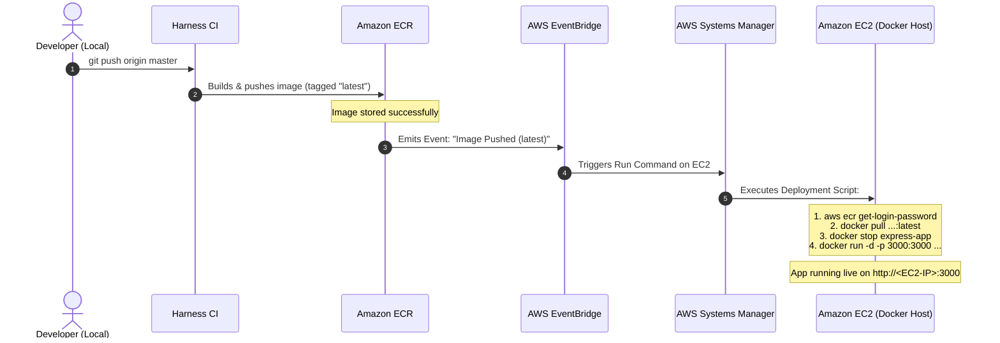

# AWS Guide: Automated Container Deployment from Amazon ECR to EC2

A practical, manual step-by-step blueprint to automatically deploy your **Express.js Docker container** to an **AWS EC2 instance** whenever a new image is pushed to **Amazon ECR** by Harness.io.

---

## Table of Contents
1. [Architecture & Automated Flow](#1-architecture--automated-flow)
2. [Step 1: Create IAM Role for the EC2 Instance](#step-1-create-iam-role-for-the-ec2-instance)
3. [Step 2: Launch the Free-Tier EC2 Instance](#step-2-launch-the-free-tier-ec2-instance)
4. [Step 3: Initial Manual Run on EC2 (Sanity Check)](#step-3-initial-manual-run-on-ec2-sanity-check)
5. [Step 4: Configure Automatic Deployment via AWS EventBridge & SSM](#step-4-configure-automatic-deployment-via-aws-eventbridge--ssm)
6. [Step 5: End-to-End Testing & Verification](#step-5-end-to-end-testing--verification)
7. [Appendix: Serverless Alternative (AWS App Runner)](#appendix-serverless-alternative-aws-app-runner)

---

## 1. Architecture & Automated Flow

While Amazon ECR is passive storage, **AWS EventBridge** and **AWS Systems Manager (SSM)** bridge the gap to make your EC2 instance self-deploying with **zero open SSH ports**.



### Key Security & Operational Benefits:
- **No Inbound SSH Needed:** AWS Systems Manager (SSM) securely executes commands over internal AWS communication channels. Port 22 can remain closed!
- **Free Tier Compatible:** Uses an Amazon EC2 `t2.micro` or `t3.micro` instance (eligible for 750 hours/month free).
- **Zero Secrets on EC2:** EC2 uses an **IAM Instance Profile** to authenticate with ECR, so you never store access keys or passwords on the server.

---

## Step 1: Create IAM Role for the EC2 Instance

Before launching the instance, create an IAM Role that grants EC2 permission to communicate with AWS Systems Manager and pull images from ECR.

1. Open the [AWS IAM Console](https://console.aws.amazon.com/iam).
2. In the left navigation, click **Roles** > click **Create role**.
3. Select trusted entity: **AWS service**.
4. Use case: Select **EC2** > click **Next**.
5. In the permissions search bar, find and check the following two managed policies:
   - **`AmazonSSMManagedInstanceCore`** (enables Systems Manager management and web shell without SSH)
   - **`AmazonEC2ContainerRegistryReadOnly`** (allows EC2 to authenticate and pull images from your ECR repositories)
6. Click **Next**.
7. **Role name:** `EC2-ECR-SSM-DeploymentRole`.
8. Click **Create role**.

---

## Step 2: Launch the Free-Tier EC2 Instance

1. Open the [Amazon EC2 Console](https://console.aws.amazon.com/ec2) in region **`us-east-1`**.
2. In the top-right, click **Launch instance**.
3. Configure the instance:
   - **Name:** `express-docker-host`
   - **Application and OS Image:** **Amazon Linux 2023 AMI** (Default, Free Tier eligible).
   - **Instance type:** **`t2.micro`** (or **`t3.micro`**).
   - **Key pair (login):** Select *Proceed without a key pair* (or select your existing key pair). You will not need SSH because AWS Systems Manager provides terminal access.
4. **Network settings** (Security Group):
   - Check **Allow HTTP traffic from the internet** (Port 80).
   - Click **Edit** network settings, and click **Add security group rule**:
     - **Type:** Custom TCP
     - **Port range:** `3000`
     - **Source type:** Anywhere (`0.0.0.0/0`)
     - **Description:** `Express REST API`
5. **Advanced details** (scroll to the bottom):
   - **IAM instance profile:** Select **`EC2-ECR-SSM-DeploymentRole`** (created in Step 1).
   - **User data** (paste this script to automatically install and start Docker on boot):
     ```bash
     #!/bin/bash
     dnf update -y
     dnf install -y docker
     systemctl start docker
     systemctl enable docker
     usermod -aG docker ec2-user
     ```
6. Click **Launch instance**.
7. Wait 1–2 minutes until the instance state shows **Running** and Status check shows **2/2 checks passed**.
8. Note down your instance's **Public IPv4 address** (e.g. `54.210.xx.xx`) and **Instance ID** (e.g. `i-0a123456789abcdef`).

---

## Step 3: Initial Manual Run on EC2 (Sanity Check)

Let's verify that the EC2 instance can pull and run your container image:

1. In the EC2 Console, select your instance `express-docker-host`.
2. Click the **Connect** button at the top.
3. Select the **Session Manager** tab and click **Connect** (this opens an instant browser terminal).
4. Run the following deployment script inside the terminal:
   ```bash
   # Switch to root or use docker
   sudo su -
   
   # Set variables
   export AWS_ACCOUNT_ID="123806350293"
   export AWS_REGION="us-east-1"
   export IMAGE_URI="${AWS_ACCOUNT_ID}.dkr.ecr.${AWS_REGION}.amazonaws.com/express-harness-demo:latest"
   
   # 1. Authenticate Docker with Amazon ECR using instance role
   aws ecr get-login-password --region ${AWS_REGION} | docker login --username AWS --password-stdin ${AWS_ACCOUNT_ID}.dkr.ecr.${AWS_REGION}.amazonaws.com
   
   # 2. Pull the latest image pushed by Harness
   docker pull ${IMAGE_URI}
   
   # 3. Run the container
   docker run -d --restart unless-stopped -p 3000:3000 --name express-app ${IMAGE_URI}
   
   # 4. Check container status
   docker ps
   ```
5. In your web browser, navigate to:
   ```text
   http://<YOUR_EC2_PUBLIC_IP>:3000/health
   ```
   You should see:
   ```json
   {
     "status": "UP",
     "service": "express-harness-demo",
     "timestamp": "2026-09-24T..."
   }
   ```

---

## Step 4: Configure Automatic Deployment via AWS EventBridge & SSM

Now we wire up the automatic trigger: **ECR Image Push -> EventBridge -> Systems Manager Run Command on EC2**.

### Step 4.1: Create IAM Role for EventBridge to invoke SSM
1. Go to [IAM Console > Roles > Create role](https://console.aws.amazon.com/iam/home#/roles).
2. Select **Custom trust policy** and paste:
   ```json
   {
     "Version": "2012-10-17",
     "Statement": [
       {
         "Effect": "Allow",
         "Principal": {
           "Service": "events.amazonaws.com"
         },
         "Action": "sts:AssumeRole"
       }
     ]
   }
   ```
3. Click **Next**.
4. Attach permission policy: Search for **`AmazonSSMAutomationRole`** (or create a policy allowing `ssm:SendCommand`).
5. Name the role: `EventBridgeToSSMRole` and click **Create role**.

---

### Step 4.2: Create the EventBridge Rule
1. Open the [Amazon EventBridge Console](https://console.aws.amazon.com/events) in **`us-east-1`**.
2. In the left navigation, click **Rules** > click **Create rule**.
3. **Name:** `ECR-To-EC2-Deploy-Rule`.
4. **Rule type:** Select **Rule with an event pattern** > click **Next**.
5. Under **Event source**, select **AWS events or EventBridge partner events**.
6. Under **Event pattern**, select:
   - **Event source:** `AWS services`
   - **AWS service:** `Elastic Container Registry (ECR)`
   - **Event type:** `ECR Image Action`
   - In the **Event pattern JSON** box, paste this exact filter:
     ```json
     {
       "source": ["aws.ecr"],
       "detail-type": ["ECR Image Action"],
       "detail": {
         "action-type": ["PUSH"],
         "result": ["SUCCESS"],
         "repository-name": ["express-harness-demo"],
         "image-tag": ["latest"]
       }
     }
     ```
7. Click **Next**.
8. In **Target 1**:
   - **Target types:** `AWS service`
   - **Select a target:** Search and select **Systems Manager Run Command**.
   - **Document:** Select **`AWS-RunShellScript`**.
   - **Target selection:** Select **Choose instances manually** > check your EC2 instance `express-docker-host`.
   - **Commands** (paste the automated update script):
     ```bash
     #!/bin/bash
     set -e
     export AWS_ACCOUNT_ID="123806350293"
     export AWS_REGION="us-east-1"
     export IMAGE_URI="${AWS_ACCOUNT_ID}.dkr.ecr.${AWS_REGION}.amazonaws.com/express-harness-demo:latest"

     # Authenticate with ECR
     aws ecr get-login-password --region ${AWS_REGION} | docker login --username AWS --password-stdin ${AWS_ACCOUNT_ID}.dkr.ecr.${AWS_REGION}.amazonaws.com

     # Pull new container image
     docker pull ${IMAGE_URI}

     # Stop and remove previous container
     docker stop express-app || true
     docker rm express-app || true

     # Launch updated container
     docker run -d --restart unless-stopped -p 3000:3000 --name express-app ${IMAGE_URI}

     # Clean up dangling unused images to save disk space
     docker image prune -f
     ```
   - **Execution role:** Select **Create a new role for this specific resource** (or choose `EventBridgeToSSMRole`).
9. Click **Next** > **Next** > **Create rule**.

---

## Step 5: End-to-End Testing & Verification

1. Make a small code change in `src/app.js` or `src/routes/items.js` (for example, change the greeting or version).
2. Commit and push:
   ```bash
   git commit -am "test: verify automated ECR to EC2 deployment"
   git push origin master
   ```
3. Watch the pipeline in **Harness CI**:
   - Step 1: `Run Tests` passes ✅
   - Step 2: `Push to ECR` builds and pushes the image with tag `latest` ✅
4. Immediately after ECR receives the push:
   - AWS EventBridge catches the `PUSH` event.
   - Systems Manager executes the `AWS-RunShellScript` on your EC2 instance.
5. In the AWS Console, open **Systems Manager** > **Run Command** > **Command history** to view the command execution status: **Success**.
6. Refresh your browser at:
   ```text
   http://<EC2-PUBLIC-IP>:3000/health
   ```
   The updated timestamp and code changes will be live!

---

## Appendix: Serverless Alternative (AWS App Runner)

If you ever want to avoid managing an EC2 Linux VM entirely, AWS provides **AWS App Runner**:

1. Open **AWS App Runner** in the AWS Console.
2. Click **Create service**.
3. Source: **Container registry** > Select **Amazon ECR**.
4. Browse and select `express-harness-demo:latest`.
5. Under **Deployment trigger**, select **Automatic**.
6. Port: `3000`.
7. Click **Create & deploy**.

AWS App Runner handles SSL certificates, autoscaling, server patching, and will automatically redeploy every time Harness pushes to ECR with zero configuration scripts.
